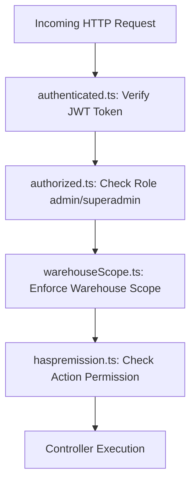

# 📘 Systego Documentation - الدليل المعماري والتشغيلي الشامل للنظام

> **تاريخ الإنشاء:** سبتمبر 2026  
> **هدف المستند:** تقديم شرح فني وتفصيلي شامل لبنية مشروع **Systego** (Node.js + Express + TypeScript + MongoDB) لمساعدة أي مطور جديد على فهم النظام بالكامل والتعديل عليه بسهولة.

---

## 📑 فهرس المحتويات
1. [نظرة عامة على المشروع (Overview)](#1-نظرة-عامة-على-المشروع-overview)
2. [تقنيات ومكتبات المشروع (Tech Stack)](#2-تقنيات-ومكتبات-المشروع-tech-stack)
3. [الهيكل التنظيمي للمجلدات (Directory Structure)](#3-الهيكل-التنظيمي-للمجلدات-directory-structure)
4. [الدليل التفصيلي للموديلز (Mongoose Schemas & Models)](#4-الدليل-التفصيلي-للموديلز-mongoose-schemas--models)
5. [الدليل التفصيلي للـ Controllers ومنطق العمل (Business Logic)](#5-الدليل-التفصيلي-للـ-controllers-ومنطق-العمل-business-logic)
6. [نظام الحماية والطبقات الوسيطة (Middlewares & Security)](#6-نظام-الحماية-والطبقات-الوسيطة-middlewares--security)
7. [آلية المزامنة اللحظية والأوفلاين (Offline POS Sync & ChangeLog)](#7-آلية-المزامنة-اللحظية-والأوفلاين-offline-pos-sync--changelog)
8. [المهام الدورية والأحداث اللحظية (Cron Jobs & Socket.IO)](#8-المهام-الدورية-والأحداث-اللحظية-cron-jobs--socketio)
9. [دليل المطور للتعديل والإضافة (Developer Workflow Guide)](#9-دليل-المطور-للتعديل-والإضافة-developer-workflow-guide)

---

## 1. نظرة عامة على المشروع (Overview)

نظام **Systego** هو نظام متكامل لإدارة موارد المؤسسات (**ERP System**)، نقاط البيع (**POS - Point of Sale**)، وإدارة المتجر الإلكتروني (**E-Commerce Storefront**)، ويدعم تعدد المستأجرين والمخازن (**Multi-Tenant & Multi-Warehouse Scope**).

### أبرز الوحدات الوظيفية للنظام:
* **نظام نقاط البيع (POS System):** بيع سريع، إغلاق وفتح الورديات (Cashier Shifts)، خيارات دفع متعددة، كروت الهدايا (Gift Cards)، وإمكانية العمل أوفلاين مع المزامنة (Sync Plugin).
* **إدارة المخازن والمستودعات (Inventory & Warehouse Management):** تتبع كميات المنتجات والـ Variations بكل مخزن، تحويلات بين المخازن (Transfers)، الجرد الآلي واليدوي (Stock Take)، التظبيطات والهوالك (Adjustments & Wasted).
* **إدارة التصنيع والمواد الخام (Bill of Materials / BOH):** ربط المنتجات بالوصفات (Recipe) والمواد الخام (Materials) وخصم المكونات تلقائياً عند البيع.
* **إدارة المشتريات والموردين (Purchasing & Suppliers):** فواتير المشتريات، مرتجعات المشتريات، دفعات الموردين والأقساط.
* **إدارة المالية والحسابات (Finance & Accounting):** شجرة الحسابات المالية (Financial Accounts)، القيود اليومية ودفتر الأستاذ (Accounting Ledger)، المدينون (Receivables)، الدائنون (Payables)، المصروفات والإيرادات والتقارير المالية.
* **المتجر الإلكتروني للعملاء (Storefront API):** تصفح المنتجات، سلة التسوق (Cart)، عناوين التوصيل (Addresses)، إنشاء الطلبات (Orders)، والمفضلة (Wishlist).
* **التكامل مع بوابات الدفع (Payment Gateways):** Paymob, Fawry, Geidea.

---

## 2. تقنيات ومكتبات المشروع (Tech Stack)

| التقنية / المكتبة | الغرض والاستخدام |
| :--- | :--- |
| **Node.js + TypeScript** | بيئة التشغيل ولغة البرمجة الأساسية لضمان قوة وبنية الأنواع (Type Safety). |
| **Express.js (v5)** | إطار عمل الـ HTTP Server والتوجيه (Routing). |
| **MongoDB + Mongoose (v8)** | قاعدة البيانات ومحرك المخططات (Schemas & Models). |
| **Socket.IO (v4)** | التحديثات والتنبيهات اللحظية لورديات الكاشير والمخازن. |
| **node-cron** | المجدول الدوري لتفقد صلاحية المنتجات، انخفاض المخزون، وتحديث الحجوزات. |
| **jsonwebtoken & bcryptjs** | التشفير، المصادقة (Auth Token)، وإدارة كلمات السر. |
| **bwip-js & pdfkit & exceljs** | توليد باركود المنتجات وطباعة الإيصالات والتقارير المالية بصيغ PDF و Excel. |

---

## 3. الهيكل التنظيمي للمجلدات (Directory Structure)

```text
Systego/
├── package.json               # ملف الاعتمادات والسكربتات (npm run dev / build)
├── tsconfig.json              # إعدادات TypeScript Compiler
├── scripts/                   # سكربتات ترحيل وحقن البيانات (UUID Migration)
└── src/                       # الكود المصدري للمشروع
    ├── server.ts              # نقطة الانطلاق تشغيل الـ Express App & Socket.IO & DB Connection
    ├── Errors/                # فئات كلاسات الأخطاء المخصصة (NotFound, BadRequest, Unauthorized, etc.)
    ├── types/                 # تعريفات الأنواع المخصصة لتراسل البيانات و Express Request Extensions
    ├── seed/                  # بيانات البذر المبدئية (مثل أنواع الطلبات Order Types)
    ├── middlewares/           # البرمجيات الوسيطة للحماية والصلاحيات وتقييد المخازن
    ├── utils/                 # الأدوات المساعدة (استجابات API, Cron Jobs, JWT, Auth, Barcode)
    ├── validation/            # مخططات التحقق من البيانات المرسلة عبر Joi
    ├── models/                # مخططات وقواعد البيانات (Mongoose Models)
    │   ├── connection.ts      # الاتصال بقاعدة بيانات MongoDB
    │   └── schema/
    │       ├── admin/         # موديلز الأدمن والنظام والمخازن والمالية
    │       │   └── POS/       # موديلز نقاط البيع والمزامنة
    │       └── users/         # موديلز المتجر الإلكتروني للعملاء
    ├── controller/            # منطق معالجة الطلبات والتحكم بالبيانات (Controllers)
    │   ├── admin/             # متحكمات لوحة الأدمن والنظام
    │   │   └── POS/           # متحكمات عمليات نقاط البيع والمزامنة
    │   └── users/             # متحكمات واجهة المتجر الإلكتروني
    └── routes/                # مسارات الـ API (Express Routes)
        ├── index.ts           # الموجه الرئيسي لجميع المسارات (/api)
        ├── admin/             # مسارات لوحة الأدمن (/api/admin)
        │   └── POS/           # مسارات نقاط البيع المخصصة
        └── users/             # مسارات المتجر الإلكتروني (/api/store)
```

---

## 4. الدليل التفصيلي للموديلز (Mongoose Schemas & Models)

تم تقسيم الموديلز داخل المشروع إلى مجموعتين رئيسيتين: `admin` (تشمل الإدارة، المخازن، المالية، الـ POS) و `users` (تخص تطبيق ومتجر العملاء).

### 4.1. موديلز الإدارة ونقاط البيع والمخازن (`src/models/schema/admin`)

#### أ. المستخدمون والصلاحيات (Users & Auth):
* [`User.ts`](file:///c:/Users/DELL/Desktop/work/Systego/src/models/schema/admin/User.ts): يمثل مستخدمي لوحة التحكم والإدارة (Admins/Cashiers/Superadmin). يحتوي على `username`, `email`, `password`, `role` ("superadmin" | "admin" | "cashier"), `warehouse_id`, `role_id`, و `permissions` (مصفوفة صلاحيات مخصصة لكل موديل وتطبيق).
* [`roles.ts`](file:///c:/Users/DELL/Desktop/work/Systego/src/models/schema/admin/roles.ts): مصفوفة الأدوار المخصصة (Custom Roles) التي تحتوي على اسم الدور وتفاصيل الصلاحيات لكل الموديولات (`module`, `actions`).
* [`Action.ts`](file:///c:/Users/DELL/Desktop/work/Systego/src/models/schema/admin/Action.ts): تعريف الأفعال المتاحة في الصلاحيات (مثل read, create, update, delete).

#### ب. المنتجات وتكلفة المخزون (Products & Catalog):
* [`products.ts`](file:///c:/Users/DELL/Desktop/work/Systego/src/models/schema/admin/products.ts): البيانات الأساسية للمنتج (Name, SKU, Barcode, Brand, Category, Unit, Tax, Description, Images).
* [`product_price.ts`](file:///c:/Users/DELL/Desktop/work/Systego/src/models/schema/admin/product_price.ts): مستويات الأسعار للمنتج (سعر التكلفة Cost Price, سعر البيع Selling Price, الأسعار الخاصة بالجملة والتجزئة).
* [`Variation.ts`](file:///c:/Users/DELL/Desktop/work/Systego/src/models/schema/admin/Variation.ts): متغيّرات المنتج (مثل اللون والحجم - Attributes & Options).
* [`category.ts`](file:///c:/Users/DELL/Desktop/work/Systego/src/models/schema/admin/category.ts): أقسام المنتجات والتصنيفات الهرمية (Parent & Sub Categories).
* [`brand.ts`](file:///c:/Users/DELL/Desktop/work/Systego/src/models/schema/admin/brand.ts): العلامات التجارية والشركات المصنعة.
* [`units.ts`](file:///c:/Users/DELL/Desktop/work/Systego/src/models/schema/admin/units.ts): وحدات القياس (كيلو، جرام، قطعة، كرتونة).

#### ج. المخازن والتحويلات والحركات (Warehouse & Inventory):
* [`Warehouse.ts`](file:///c:/Users/DELL/Desktop/work/Systego/src/models/schema/admin/Warehouse.ts): تعريف المخزن/الفرع (Name, Phone, Address, Location).
* [`Product_Warehouse.ts`](file:///c:/Users/DELL/Desktop/work/Systego/src/models/schema/admin/Product_Warehouse.ts): الجدول الوسيط الذي يحدد كمية كل منتج أو متغيّر منتج داخل كل مخزن محدد (`product_id`, `warehouse_id`, `quantity`, `low_stock_threshold`, `expiry_date`).
* [`Stock.ts`](file:///c:/Users/DELL/Desktop/work/Systego/src/models/schema/admin/Stock.ts): سجل حركة المخزون الكلية.
* [`Transfer.ts`](file:///c:/Users/DELL/Desktop/work/Systego/src/models/schema/admin/Transfer.ts): تحويلات البضائع بين المستودعات (`fromWarehouseId`, `toWarehouseId`, `items`, `status`: pending/approved/rejected).
* [`stockTake.ts`](file:///c:/Users/DELL/Desktop/work/Systego/src/models/schema/admin/stockTake.ts) & [`stockTakeItem.ts`](file:///c:/Users/DELL/Desktop/work/Systego/src/models/schema/admin/stockTakeItem.ts): عملية جرد المخزن (طابق الكمية الفعلية مع كمية النظام وتسجيل الفروقات).
* [`adjustments.ts`](file:///c:/Users/DELL/Desktop/work/Systego/src/models/schema/admin/adjustments.ts): تعديلات وتظبيط كميات المخزون بالزيادة أو النقصان.
* [`wasted.ts`](file:///c:/Users/DELL/Desktop/work/Systego/src/models/schema/admin/wasted.ts): المنتجات الهالكة والتالفة وأسباب الهالك.
* [`selectReason.ts`](file:///c:/Users/DELL/Desktop/work/Systego/src/models/schema/admin/selectReason.ts): أسباب تسوية المخزون والتلفيات.

#### د. نقاط البيع والوردية (POS System Models - `schema/admin/POS`):
* [`Sale.ts`](file:///c:/Users/DELL/Desktop/work/Systego/src/models/schema/admin/POS/Sale.ts): فواتير مبيعات نقاط البيع. تحتوي على رقم الفاتورة, `customer_id`, `warehouse_id`, `cashier_id`, `shift_id`, `total_amount`, `discount_amount`, `tax_amount`, `paid_amount`, `payment_method`, و `products` (المنتجات المباعة والأسعار والكميات).
* [`CashierShift.ts`](file:///c:/Users/DELL/Desktop/work/Systego/src/models/schema/admin/POS/CashierShift.ts): وردية الكاشير. تسجل وقت الفتح والإغلاق، المبلغ الافتتاحي (Opening Balance)، النقدية المتوقعة (Expected Cash)، النقدية الفعلية (Actual Cash)، والمصاريف.
* [`cashier.ts`](file:///c:/Users/DELL/Desktop/work/Systego/src/models/schema/admin/POS/cashier.ts): بيانات موظف الكاشير والرمز السري (PIN Code) والفرع التابع له.
* [`customer.ts`](file:///c:/Users/DELL/Desktop/work/Systego/src/models/schema/admin/POS/customer.ts): بيانات عملاء نقاط البيع، الرصيد المالي المستحق، ونقاط الولاء التراكمية.
* [`ReturnSale.ts`](file:///c:/Users/DELL/Desktop/work/Systego/src/models/schema/admin/POS/ReturnSale.ts): مرتجعات مبيعات POS وإعادة الكميات للمخزن.
* [`expenses.ts`](file:///c:/Users/DELL/Desktop/work/Systego/src/models/schema/admin/POS/expenses.ts): المصاريف النثرية أثناء وردية الكاشير وخصمها من الدرج.
* [`giftCard.ts`](file:///c:/Users/DELL/Desktop/work/Systego/src/models/schema/admin/POS/giftCard.ts): كروت الهدايا والرصيد المتبقي لاستخدامها في الشراء.
* [`payment.ts`](file:///c:/Users/DELL/Desktop/work/Systego/src/models/schema/admin/POS/payment.ts): المدفوعات المجزأة الخاصة بالفواتير.
* [`ChangeLog.ts`](file:///c:/Users/DELL/Desktop/work/Systego/src/models/schema/admin/POS/ChangeLog.ts) & [`syncPlugin.ts`](file:///c:/Users/DELL/Desktop/work/Systego/src/models/schema/admin/POS/syncPlugin.ts): نظام تتبع التغيرات في قاعدة البيانات لدعم المزامنة مع أجهزة الـ POS الأوفلاين.

#### هـ. المشتريات والموردين (Purchases & Suppliers):
* [`suppliers.ts`](file:///c:/Users/DELL/Desktop/work/Systego/src/models/schema/admin/suppliers.ts): بيانات الموردين والمبالغ المستحقة لهم.
* [`Purchase.ts`](file:///c:/Users/DELL/Desktop/work/Systego/src/models/schema/admin/Purchase.ts) & [`purchase_item.ts`](file:///c:/Users/DELL/Desktop/work/Systego/src/models/schema/admin/purchase_item.ts): أمر الشراء وفاتورة المشتريات القادمة من المورد وإدخالها للمخزن.
* [`ReturnPurchase.ts`](file:///c:/Users/DELL/Desktop/work/Systego/src/models/schema/admin/ReturnPurchase.ts): مرتجعات المشتريات للموردين.
* [`PurchaseInstallment.ts`](file:///c:/Users/DELL/Desktop/work/Systego/src/models/schema/admin/PurchaseInstallment.ts) & [`purchase_due_payment.ts`](file:///c:/Users/DELL/Desktop/work/Systego/src/models/schema/admin/purchase_due_payment.ts): جدولة مبالغ المشتريات الآجلة والدفعات.

#### و. التصنيع والمواد الخام (BOH / Recipe):
* [`Materials.ts`](file:///c:/Users/DELL/Desktop/work/Systego/src/models/schema/admin/Materials.ts): المواد الخام (مثل السكر، الدقيق، البن).
* [`Recipe.ts`](file:///c:/Users/DELL/Desktop/work/Systego/src/models/schema/admin/Recipe.ts): وصفات المنتجات التي تربط المنتج النهائي بنسب وتكميل المواد الخام لخصمها تلقائياً عند بيع المنتج.
* [`Category_Material.ts`](file:///c:/Users/DELL/Desktop/work/Systego/src/models/schema/admin/Category_Material.ts): تصنيفات المواد الخام.

#### ز. المالية والقيود والمصروفات (Finance & Accounting):
* [`Financial_Account.ts`](file:///c:/Users/DELL/Desktop/work/Systego/src/models/schema/admin/Financial_Account.ts): الحسابات البنكية والخزائن المالية (Bank Accounts / Cash Counters).
* [`AccountingLedger.ts`](file:///c:/Users/DELL/Desktop/work/Systego/src/models/schema/admin/AccountingLedger.ts): دفتر الأستاذ العام وتسجيل القيود المالية المدينة والدائنة.
* [`Revenue.ts`](file:///c:/Users/DELL/Desktop/work/Systego/src/models/schema/admin/Revenue.ts) & [`RevenueCategory.ts`](file:///c:/Users/DELL/Desktop/work/Systego/src/models/schema/admin/RevenueCategory.ts): الإيرادات الأخرى وتقسيماتها.
* [`expensecategory.ts`](file:///c:/Users/DELL/Desktop/work/Systego/src/models/schema/admin/expensecategory.ts): تصنيفات المصروفات العامة.

---

### 4.2. موديلز المتجر الإلكتروني للعملاء (`src/models/schema/users`)

* [`Address.ts`](file:///c:/Users/DELL/Desktop/work/Systego/src/models/schema/users/Address.ts): عناوين شحن العميل (المدينة، المنطقة، الشارع، المبنى).
* [`Cart.ts`](file:///c:/Users/DELL/Desktop/work/Systego/src/models/schema/users/Cart.ts): سلة تسوق العميل عبر المتجر، وتحتوي على قائمة المنتجات والكميات المحددة.
* [`Order.ts`](file:///c:/Users/DELL/Desktop/work/Systego/src/models/schema/users/Order.ts): طلبات الشراء أونلاين عبر المتجر مع حالة الطلب (`pending`, `processing`, `shipped`, `delivered`, `cancelled`) وتفاصيل الشحن والدفع.

---

## 5. الدليل التفصيلي للـ Controllers ومنطق العمل (Business Logic)

تحتوي الكنترولرات في `src/controller` على المنطق التنفيذي المعقد للنظام:

### 5.1. متحكم بيع الـ POS (`saleController.ts`)
* **إنشاء فاتورة البيع (`createSale`):**
  1. التحقق من وجود وردية مفتوحة للكاشير (`CashierShift`).
  2. فحص الكميات المتاحة في جدول `Product_Warehouse` للمخزن المحدد.
  3. حساب الخصومات (`Coupons`, `Discounts`), الضرائب (`Taxes`), ورسوم الخدمة (`ServiceFee`).
  4. تنفيذ خصم المخزون ذرّياً (Atomic Decrement) لمنع حالة السباق (Race Conditions).
  5. في حال وجود وصفة تصنيع (`Recipe`) للمنتج، يتم خصم كميات المواد الخام المعنية تلقائياً من المخزن.
  6. إنشاء سجل البيع وسجلات المدفوعات في `SaleModel` و `PaymentModel`.
  7. تجميع وتحديث نقاط الولاء الخاصة بالعميل (`CustomerModel`).

### 5.2. متحكم وردية الكاشير (`CashierShiftController.ts`)
* **فتح الوردية (`openShift`):** تسجيل المبلغ الابتدائي والتأكد من عدم وجود وردية مفتوحة لنفس الكاشير.
* **إغلاق الوردية (`closeShift`):** حصد جميع فواتير البيع والمقبوضات والمصروفات خلال الوردية، مقارنة المبلغ المتوقع بالنقدية الفعلية المدخلة وتسجيل العجز أو الزيادة.

### 5.3. متحكم الجرد والتظبيط (`stockTake.ts` & `adjustments.ts`)
* **الجرد (`StockTake`):** يتيح إدخال الكميات الموصوفة فعلياً بالمخزن، وحساب الفروقات بين كميات النظام والكميات الحقيقية، ثم اعتماد الجرد لتعديل الكميات بالزيادة أو النقصان تلقائياً وتوليد قيود تسوية.

### 5.4. متحكم ترحيل التحويلات (`Transfer.ts`)
* عند إنشاء أمر تحويل بضاعة بين مخزنين، يتم حجز الكميات. وعند تغيير حالة التحويل إلى "مقبول" (`approved`)، يتم خصم المنتجات من المخزن المصدر وإضافتها تلقائياً إلى المخزن الوجهة.

---

## 6. نظام الحماية والطبقات الوسيطة (Middlewares & Security)

يستخدم مشروع **Systego** نظام حماية متعدد الطبقات لضمان أمان البيانات وتقييد الصلاحيات:



### 1. [`authenticated.ts`](file:///c:/Users/DELL/Desktop/work/Systego/src/middlewares/authenticated.ts)
* يفحص التوكن `Bearer Token` المرسل في الـ Header.
* يستخرج بيانات المستخدم والدور (`role`) ورقم المخزن (`warehouse_id`).
* يقوم بدمج صلاحيات الدور المخصص مع صلاحيات المستخدم الفردية (**Dynamic Permission Merging**) وحقنها في الأوبجكت `req.user`.

### 2. [`authorized.ts`](file:///c:/Users/DELL/Desktop/work/Systego/src/middlewares/authorized.ts)
* يتأكد من أن مستخدم الطلب يمتلك أحد الأدوار المسموح بها للمسار (مثال: `authorizeRoles("admin", "superadmin")`).

### 3. [`warehouseScope.ts`](file:///c:/Users/DELL/Desktop/work/Systego/src/middlewares/warehouseScope.ts)
* **حماية الصلاحية النطاقية للمخازن (Warehouse Isolation):**
* يمنع أي أدمن فرعي من قراءة أو تعديل بيانات مخزن آخر غير المخزن المعين له في `req.user.warehouse_id`.
* يقوم بحقن `warehouse_id` تلقائياً في الاستعلامات (`req.query` أو `req.body`) لمنع تسرب البيانات بين الفروع.

### 4. [`errorHandler.ts`](file:///c:/Users/DELL/Desktop/work/Systego/src/middlewares/errorHandler.ts)
* ملتقط الأخطاء المركزي (Central Error Handler). يتعرف على أنواع الأخطاء المخصصة الممتدة من [`CustomError`](file:///c:/Users/DELL/Desktop/work/Systego/src/Errors/) وتوليد استجابة JSON موحدة تحتوي على حالة الخطأ والرسالة.

---

## 7. آلية المزامنة اللحظية والأوفلاين (Offline POS Sync & ChangeLog)

إحدى أقوى ميزات مشروع Systego هي دعم العمل أوفلاين في نقاط البيع عبر إضافة Mongoose Plugin مخصصة: [`syncPlugin.ts`](file:///c:/Users/DELL/Desktop/work/Systego/src/models/schema/admin/POS/syncPlugin.ts).

### كيف تعمل المزامنة (Sync Mechanism)؟
1. **تتبع التغييرات (`ChangeLog`):** تم ربط `syncPlugin` بجميع الجداول الحساسة (المبيعات، المنتجات، المخازن، العملاء...). عند حدوث أي عملية إضافة (`insert`) أو تعديل (`update`) أو حذف (`delete`) على MongoDB، تقوم الـ Plugin بتسجيل التغيير فوراً في جدول `ChangeLog`.
2. **التعديلات التراكمية (Incremental Numeric Deltas):** بالنسبة للقيم الرقمية الحساسة مثل كمية المنتج (`quantity`) أو رصيد البنك (`balance`)، بدلاً من حفظ القيمة المطلقة، يتم حفظ الفارق (`$inc delta`) لضمان عدم اندماج البيانات بشكل خاطئ عند تزامن أكثر من جهاز.
3. **نقاط الـ Sync API:**
   * `GET /api/sync/bootstrap/:table`: جلب النسخة الأولية الكاملة لأي جدول للنظام أوفلاين.
   * `POST /api/sync/push`: رفع التغييرات المنفذة على نقاط البيع الأوفلاين إلى السيرفر الرئيسي مع معالجة منسقة للتعارضات (Idempotency check via `sourceChangeId`).
   * `GET /api/sync/pull`: جلب التغييرات التراكمية الجديدة من السيرفر لأجهزة الـ POS بناءً على الوقت (`since`).

---

## 8. المهام الدورية والأحداث اللحظية (Cron Jobs & Socket.IO)

### 1. الأحداث اللحظية عبر Socket.IO (`src/server.ts`)
يتم تشغيل سيرفر Socket.IO على نفس البورت، وتتيح إرسال إشعارات لحظية للعملاء والموظفين عند:
* فتح وإغلاق الورديات.
* تعديل كميات المنتجات فورياً على الشاشة.

### 2. المهام الدورية (Cron Jobs)
* **مراقبة الصلاحيات وانخفاض المخزون (`src/utils/expiry_lowstock.ts`):** يتم تشغيله دورياً لفحص المنتجات القريبة من تاريخ الانتهاء، أو التي قل رصيدها عن الحد الأدنى (`low_stock_threshold`) وإرسال إشعارات تنبيهية للإدارة.
* **متابعة الحجوزات (`src/utils/bookingcheck.ts`):** تفقد حالة الحجوزات المنتهية وتحديث حالتها تلقائياً.

---

## 9. دليل المطور للتعديل والإضافة (Developer Workflow Guide)

إذا أردت إضافة ميزة جديدة أو تعديل كود كائن بالمشروع، اتبع الخطوات التالية:

### أ. كيفية إضافة موديل ومسار جديد (New Entity Workflow):
1. **إنشاء الموديل (Model):** أنشئ ملف Schema في `src/models/schema/admin/YourModel.ts` وحدد الحقول والعلاقات ورقم المخزن إن وجد.
2. **إنشاء المتحكم (Controller):** أنشئ ملف Controller في `src/controller/admin/YourController.ts` واكتب الدوال (`getAll`, `getById`, `create`, `update`, `delete`). استخدم دائماً `SuccessResponse(res, data)` للاستجابات القياسية.
3. **إنشاء الموجه (Route):** أنشئ ملف Router في `src/routes/admin/YourRoute.ts` واربط المسارات بالـ Middlewares المناسبة (`authenticated`, `haspremission`).
4. **تسجيل المسار:** أضف المسار في الموجه الرئيسي `src/routes/admin/index.ts`.

### ب. قواعد هامة عند التعديل على الكود القائم:
* ⚠️ **عدم خصم المخزون يدوياً بدون حماية:** دائماً استخدم الأوامر الذرية مثل `findOneAndUpdate` مع `$inc: { quantity: -amount }` وتأكد من التحقق من رصيد المخزن في `Product_Warehouse`.
* ⚠️ **الحفاظ على النطاق `warehouse_id`:** تأكد عند كتابة أي Query في الكنترولر من تضمين `warehouse_id` لحماية عزل فروع ومخازن المؤسسة.
* ⚠️ **عدم تعديل `syncPlugin.ts` بدون حذر:** أي تعديل في بنية المزامنة قد يؤثر على عمل أجهزة الـ POS الأوفلاين.

---
> **تم بحمد الله تفصيل وبناء الدليل بنجاح ليكون مرجعك الأول أثناء العمل والتطوير.**
